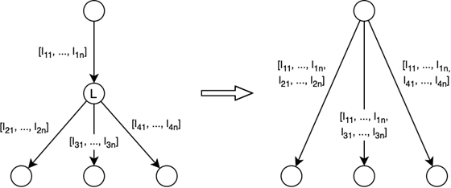
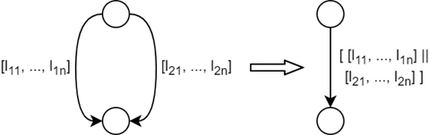
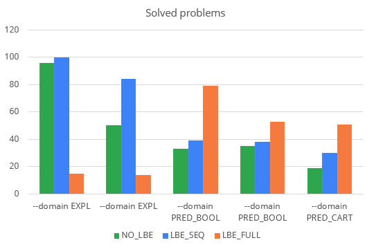
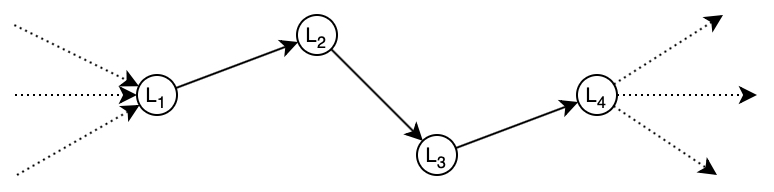
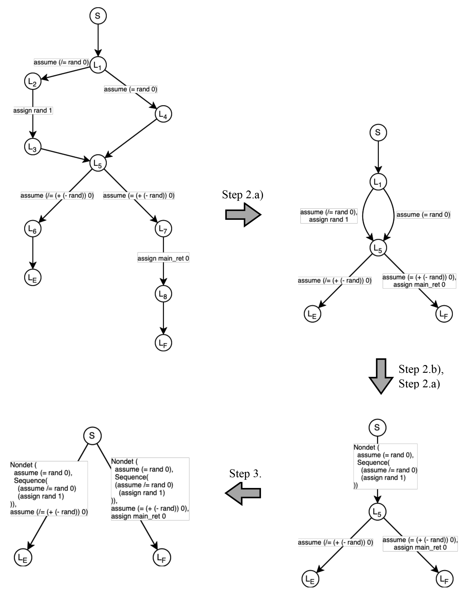

# **Large Block Encoding**

Authors: Márk Somorjai, Csanád Telbisz
December 2021

## **Table of contents**

**[Configurations](#Configurations)**

**[Transformation](#Transformation)**

_[Definitions](#Definitions)_

_[Steps](#Steps)_

_[Algorithm](#Algorithm)_

_[Example](#Example)_

**[Implementation](#Implementation)**


<a name="Configurations"></a>
# Configurations

We implemented the algorithm in Java, as a procedural pass in the Theta model checking framework. Passes transform the CFA in different ways, before the verification algorithm can begin. We have opened a pull request, to have our pass be integrated in the framework.

The following configurations can be applied to LBE by setting the `--lbe` flag when running Theta (see the definitions below for further details):

- `NO_LBE`: Turns off LBE completely
- `LBE_SEQ`: Only collapses snakes and removes middle locations (_see 1st image below_)
- `LBE_FULL`: Collapses snakes and parallel edges, removes middle locations (_see 2nd image below_)

<p align="center">

</p>

<p align="center">

</p>

`LBE_FULL` configuration performs better with predicate abstraction (both boolean and cartesian). `LBE_SEQ` gives better results in almost every case than `NO_LBE`. The diagram below illustrates the results of 133 benchmark tests:

<p align="center">

</p>

A more detailed representation of the test results can be seen on [this quantile plot](LBE-images/quantile_plot.png).

<a name="Transformation"></a>
## Transformation

The transformation turns a single block encoded CFA into a large block encoded CFA. During the transformation, each loop-free subgraph of the CFA is replaced by a single edge with a larger formula representing the removed subgraph.

<a name="Definitions"></a>
## Definitions

In order to make the algorithm more understandable, the following definitions were introduced:

**snake:** A graph component, where the incoming and outgoing degree of every location is 1, apart from the two ends of the subgraph.

_Example: nodes {L<sub>1</sub>, L<sub>2</sub>, L<sub>3</sub>, L<sub>4</sub>} and the edges between them form a snake._

<p align="center">

</p>

**parallel edges:** Edges with the same source and target location.

_Example: edges {e<sub>1</sub>, e<sub>2</sub>, e<sub>3</sub>} are parallel edges._

<p align="center">

</p>

**middle location:** A location with an incoming degree of 1 and an outgoing degree that's at least 1.

_Example: L<sub>2</sub> and L<sub>3</sub> are middle locations, while L<sub>1</sub>, L<sub>4</sub> and L<sub>5</sub> are not._

<p align="center">

</p>

<a name="Steps"></a>
## Steps

Using the definitions above, the algorithm can be divided into 3 main steps:

### 1. Error locations to sinks

To prepare the CFA for transformation, precautionary steps need to be taken to avoid giving wrong results. In this step, all outgoing edges are removed from error locations. This is to make sure they don't disappear later on in the transformation, because locations with in- and outgoing edges could be removed. From a software verification standpoint this step has no effect, since the goal is to determine whether error locations are reachable or not, and outgoing edges do not affect reachability.

### 2. Remove parallel edges and snakes

In this step, all parallel edges and snakes are removed from the CFA. This is done by doing the following 2 operations on all locations where they are applicable, until there is none:

#### a) Collapse outgoing parallel edges into a single edge

The visited location is checked for outgoing edges that go the same target. If found, the parallel edges are removed from the graph. The labels that were on them are combined by the _or_ operator (||), and put on a single edge going from the visited location to the original target location. Example of this can be seen below, with the visited location being L.

<p align="center">

</p>

Before the operation, going from the visited location to the target was only possible, if any of the parallel edges&#39; labels were satisfied. This stays true after the transformation thanks to the _or_ operator, thus the original semantics are kept.

#### b) Collapse part of snake into a single edge

If the visited location has a single incoming and outgoing edge, it is part of a snake. In this case, the location is removed. The labels that were on the incoming and outgoing edge are combined by the _and_ operator (, or &&), and put on a single edge going from the incoming edge's source location to the outgoing edge's target location. An example of this can be seen below, with the visited location being L.

<p align="center">

</p>

Before the operation, going from the source of the incoming edge to the target of the outgoing edge was only possible, if both of the incoming and outgoing edges' labels were satisfied. This still is the case after the operation thanks to the semantics of the _and_ operator, therefore the original semantics are kept.

### 3. Remove middle locations

In this step, middle locations are removed from the CFA. If a middle location is found, it is removed. For each outgoing edge from the middle location a new one is created, between the source of the incoming edge of the middle location and the target of the outgoing edge. The labels on incoming and outgoing edges are combined by the _and_ operator (, or &&), and are put on the new edge. An example of this can be seen below, with L being the middle location.

<p align="center">

</p>

This step is similar to 2.b), the difference being that here all middle locations are removed, not just parts of snakes. By the same reasoning, going from the source of the incoming edge to the target of the outgoing edge before the operation was only possible, if both of the incoming and outgoing edges' labels were satisfied. This still is the case after the operation thanks to the semantics of the _and_ operator, therefore the original semantics are kept.

<a name="Algorithm"></a>
## Algorithm

With the steps now defined, the algorithm consists of the following:

- Do step 1 once. This makes sure the error location will not be removed.
- Do step 2 and 3 repeatedly, as long as any of them can be applied. That is, until there are no more snakes, parallel edges and middle locations in the CFA.

At first glance, the complexity of the algorithm seems exponential due to the fact that doing almost any of steps 2.a), 2.b) and 3. can create new snakes, parallel edges and middle locations, because of which all locations need to be checked again and again. However, all steps remove at least a location or an edge, meaning the number of locations to check decreases. Combined with storing what locations could&#39;ve been affected by the executed steps (further discussed in the implementation section), the algorithmic complexity can be reduced O((N + M) \* M), where N is the number of nodes, M is the number of edges in the CFA.

<a name="Example"></a>
## Example

```cpp
void reach_error();
    int main() {
    int rand;
    if (rand) {
        rand = 1;
    }
    if (rand) {
        reach_error();
    }
    return 0;
}
```


The steps of the transformation are illustrated on an example below. The program and its representative single block encoded CFA are given in the beginning:

<p align="center">

</p>

<a name="Implementation"></a>
# Implementation

The implementation follows the steps described above closely, the steps are implemented as functions:

- _collapseParallelsAndSnakes_ implements step 2.
- _collapseParallelEdges_ implements step 2.a)
- _collapsePartOfSnake_ implements step 2.b)
- _removeAllMiddleLocation_ implements step 3.

The repeated checking and collapsing happens in functions _removeAllMiddleLocations_ and _collapseParallelsAndSnakes._ To reduce complexity, a list of locations to check for snakes, parallel edges and middle locations is kept and passed around between the functions. By default, all locations are in the list. As the steps get executed repeatedly, only locations that had a parent or a child change get added back to the list, while all visited locations are removed. More specifically, locations that had one of the following happen to them are added to the list and are checked again:

- Parallel edges coming into a location have been collapsed.
- A location had a part of a snake outgoing from it, which has been collapsed.

This reduces the amount of unnecessary checking done on parts of the CFA that didn't change.
