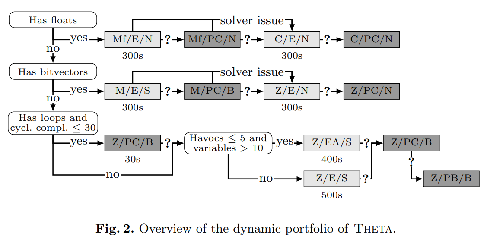

# Portfolio in Theta
As Theta is a configurable framework, there is a large amount of possible parameters, mostly configuring the CEGAR analysis. Changing the default values of these parameters requires experience with the analysis and the algorithms, but finding a proper configuration often means the difference between solving or not solving the input.

The main goal of the portfolio is to provide a simple, general way of checking input tasks without the need to care about the configurations by integrating this experience into a complex portfolio with algorithm selection.

For a more advanced user, it also provides the ability to create further portfolios of different configurations based on different decisions and/or a sequential order.

## Usage
Usage of the portfolio simply happens by using the `--portfolio` flag with a parameter (see below). It overrides other flags, so further configuration is not possible, except the flags controlling the verbosity of the output (e.g. `--loglevel`, `--output-results`).

### Complex (dynamic) portfolio
*Use `--portfolio COMPLEX` as a parameter to use this portfolio.*

The complex portfolio has a global timeout of approximately 900 seconds.

"Based on preliminary experiments and domain knowledge, we manually constructed a dynamic algorithm selection portfolio for SV-COMP'22, illustrated by Figure.
Rounded white boxes correspond to decision points.
We start by branching on the arithmetic (floats, bitvectors, integers).
Under integers, there are further decision points based on the cyclomatic complexity and the number of havocs and variables.
Grey boxes represent configurations, defining the *solver\domain\refinement* in this order.
Lighter and darker grey represents explicit and predicate domains respectively.
Internal timeouts are written below the boxes.
An unspecified timeout means that the configuration can use all the remaining time.
The solver can be CVC4 (C), MathSAT (M), MathSAT with floats (Mf) or Z3 (Z).
Abstract domains are explicit values (E), explicit values with all variables tracked (EA), Cartesian predicate abstraction (PC) or Boolean predicate abstraction (PB).
Finally, refinement can be Newton with weakest preconditions (N), sequence interpolation (S) or backward binary interpolation (B).
Arrows marked with a question mark (?) indicate an inconclusive result, that can happen due to timeouts or unknown results.
Furthermore, this year's portfolio also includes a novel dynamic (run-time) check for refinement progress between iterations that can shut down potential infinite loops (by treating them as unknown result).
Note also that for solver issues (e.g., exceptions from the solver) we have different paths in some cases."

(figure and description from the [SV-COMP 2022 tool paper](http://ftsrg.mit.bme.hu/paper-tacas2022-theta/paper.pdf))

### Sequential (simple) portfolio
*Use `--portfolio SIMPLE` as a parameter to use this portfolio.*

The simple sequential portfolio is simply a configuration of three different configurations in a sequential order. Each of the three has a 300 second local timeout.
The configurations are:
1. An explicit analysis (mainly for the simpler tasks to finish these as early as possible)
2. A predicate analysis (mainly for more complex tasks, where explicit analysis fials/gets stuck)
3. A Newtonian analysis (mainly to handle bitvector arithmetics as well)

The precise parameters of these configurations:
1. `–domain EXPL –initprec EMPTY –search ERR –encodingLBE –refinement SEQ_ITP –maxenum 1 –precgranularityGLOBAL –prunestrategy LAZY`
2. `–domain PRED_CART –initprec EMPTY –search ERR–encoding  LBE  –refinement  BW_BIN_ITP  –predsplitWHOLE –precgranularity GLOBAL –prunestrategy LAZY`
3. `–domain  EXPL  –initprec  EMPTY  –search  ERR  –encoding  LBE  –refinement  NWT_IT_WP  –maxenum1 –precgranularity GLOBAL –prunestrategy LAZY`

### Adding further portfolios

## Limitations
### Limited to XCFA
The current version of the portfolio was created specifically to verify C programs transformed to the XCFA formalism. In the future it will be available for further formalisms.

### Limitations/Errors due to Threads

## Further Details
The portfolio was implemented as part of the bachelor's thesis work of Zsófia Ádám, available [here](https://zenodo.org/record/5907927).

The complex portfolio was used on SV-COMP 2022, the resulting tool paper can be found [here](http://ftsrg.mit.bme.hu/paper-tacas2022-theta/paper.pdf).

## Future Plans
* We are planning on refactoring portfolio to work with all formalisms and configuraitons of Theta
* We also plan to introduce configuration files to make the creation of further portfolios easier (instead of having to develop a subclass for the AbstractPortfolio)
* Theta might go through an architectural refactoring process to create a more modular, portfolio-centric architecture
