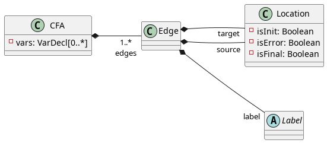

# XCFA Formalism

The eXtended Control Flow Automaton formalism was created to represent multi-threaded programs containing multiple procedures in its specification. Conventionally, CFAs were used to model programs, but to achieve a better representation of modern, complex software, it had to be adapted - hence the XCFA.

An XCFA is a collection of Control Flow Automata (CFAs), extended with further elements: procedures, procedure calls, parameters, thread- and shared memory operations, etc.  

# Control Flow Automata

A CFA is defined as the tuple $(V, L, l_0, E, Ops)$, where:

* \(V\): set of variables
* $L$: set of locations representing the program counter (PC)
* $l_0 \in L$: initial location in $L$
* $E \subseteq L \times \mathit{Ops} \times L$: directed edges in the CFA, describing the operation to be executed when the program advances to a new location
* $\mathit{Ops}$: the set of labels over the edges of the CFA. For conventional CFAs, these include:
    * assignments ($\mathit{var} := \mathit{expr}$), assigning a new value to a variable
    * assumptions ($[\mathit{expr}]$), enforcing a guard condition on an edge 
    * havocs ($\mathit{havoc}\ \mathit{var}$), nondeterministically assigning a new value to a variable

Furthermore, CFAs might have designated *error* and *final* locations in $L$, signalling an erroneous control location or the end of the program.

