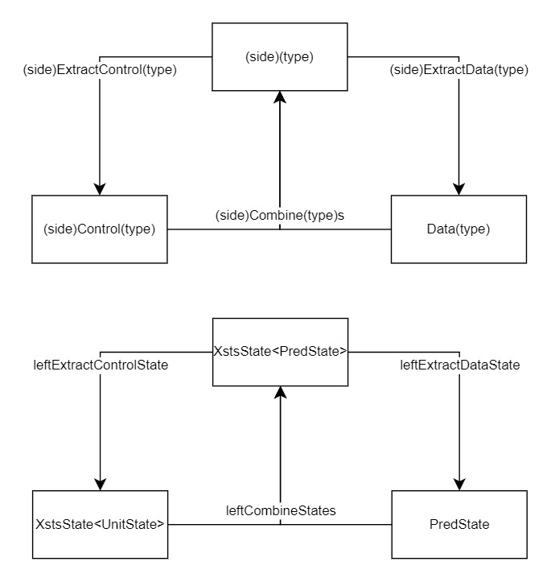
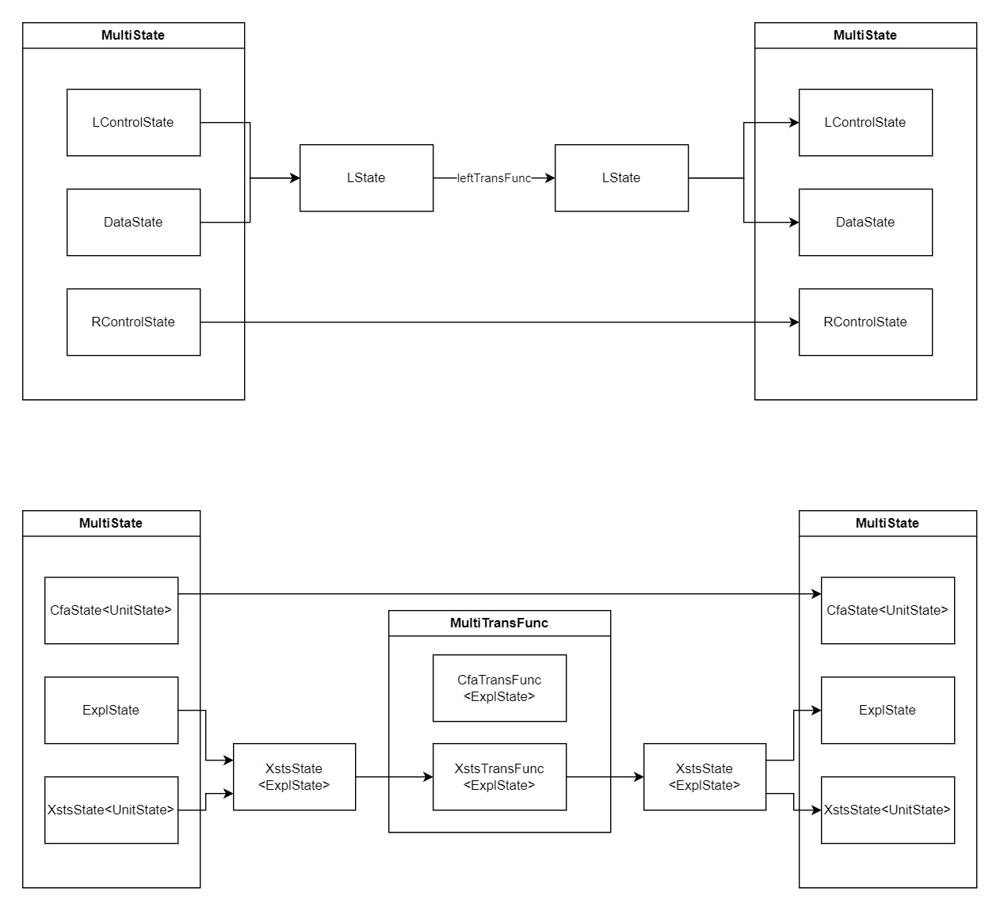

# Multi-product

This package makes it possible to create a product of any number of models. That is done by creating
the combination of 2 models, than recursively combining the result with the next model or another product.

## Generics and multi-types

To make sure the models to be made a product of can really work together (mainly that they are in
the same domain), generics are widely used in every class and function of this package.
In theta, domain is usually bound by the state and precision types, e.g. ExplState and ExplPrec.
Specific models encapsulate these types and put their structural information on top,
like CfaState&lt;ExplState> and CfaPrec&lt;ExplPrec>.

In this package, the latter complex types bear no special names. If they are stripped from their
domain information, and have only their structural (e.g. CfaState&lt;UnitState>,
CfaPrec&lt;UnitPrec>),
they are called control. The domain-independent information, that must be common between the two
sides, are called data. So the unified naming convention is the following for generic types:
(side)(part)(type) where
- side: L, R or _blank_. L for left and R for right, omitted if the class containing the generic is related to a single side only
- part: Control, data or _blank_ as described as above
- type: State or Prec. State can be omitted (used usually for control states)

The transformation between these types are handled by functions, for which the same rule applies and work the following way:

On the bottom diagram you can see a concrete example of XstsState<PredState>.

Every standard building block of theta (State, Action, Prec, Analysis, LTS) ha a multi
counterpart. They are all abstract, and currently only have a single implementation (Expr and Stmt).
But to be able to support additional ones in the future, without possibly mixing them up, these are
also bound by generics.

Summarizing the above using a CFA and xCFA in the explicit domain as an example:

| Generic name  | Description                                                                              | Example                                                                       |
|:-------------:|------------------------------------------------------------------------------------------|-------------------------------------------------------------------------------|
|    LState     | The original state of the left formalism                                                 | CfaState&lt;ExplState>                                                        |
|    RState     | The original state of the right formalism                                                | XcfaState&lt;ExplState>                                                       |
|   DataState   | The domain specific state without any structure of models                                | ExplState                                                                     |
|   LControl    | State type containing only the structural information of the left model                  | CfaState&lt;UnitState>                                                        |
|   RControl    | State type containing only the structural information of the right model                 | XcfaState&lt;UnitState>                                                       |
|    LAction    | Action type of the left formalism                                                        | CfaAction                                                                     |
|    RAction    | Action type of the right formalism                                                       | XcfaAction                                                                    |
|     LPrec     | Original precision type of the left formalism                                            | CfaPrec&lt;ExplPrec>                                                          |
|     RPrec     | Original precision type of the right formalism                                           | XcfaPrec&lt;ExplPrec>                                                         |
|   DataPrec    | Precision type of the domain                                                             | ExplPrec                                                                      |
| LControlPrec  | Precision type of the left formalism with only the model structure specific information  | CfaPrec&lt;UnitPrec>                                                          |
| RControlPrec  | Precision type of the right formalism with only the model structure specific information | XcfaPrec&lt;UnitPrec>                                                         |
|    MState     | The type of the used multi state - currently only ExprMultiState                         | ExprMultiState&lt;CfaState&lt;ExplState>, XcfaState&lt;ExplState>, ExplState> |
| MControlState | The same as above but with the blank state generic parameters                            | ExprMultiState&lt;CfaState&lt;UnitState>, XcfaState&lt;UnitState>, ExplState> |
|    MAction    | The type of the used multi action - currently only StmtMultiAction                       | StmtMultiAction&lt;CfaAction, XcfaAction>                                     |
|   MAnalysis   | The type of the used multi analaysis - currently only StmtMultiAnalysis                  | StmtMultiAnalysis&lt;...>                                                     |
|     MLts      | The type of the used multi LTS - currently only StmtMultiLts                             | StmtMultiLts&lt;...>                                                          |

## MultiAnalysis

### Initial function
MultiInitFunc works in a rather simple way. It requires the two control init functions, and a data init function. It calls all three, than
creates MultiStates with the descartes product of the results. The source side is null in initial MultiStates.

### Transfer function
The MultiTransFunc encompasses two whole transfer functions (which operate on complex states). When the left formalism is set to 
take the next step, the left control state and the data state from the multistate are combined
into a left state, which now the left transfer function can process. From the result left state are then the control and data states
extracted, and a new multi state is created with them and the right control state from the earlier multistate. This can be seen on the following
picture, than a concrete example with a product of a CFA and XSTS.

## Usage

Products should be created by using the `StmtMultiBuilder` class. After this,
the `StmtMultiConfigBuilder` can be used to run safety checking on the product.

You can find examples in the test module of the package, e.g. [MultiNondetDiningPhilosophersTest](../../../../../../../../../test/kotlin/hu/bme/mit/theta/analysis/multi/MultiNondetDiningPhilosophersTest.kt).

## Order of product creation

The stepping order of the model is defined by a function on each composition level, so the order in
which
the models are added to the product should be set keeping that in mind.

Let's say for example we want to create the product of three models A, B and C and want them to take
action in the following way: 
A &rarr; B &rarr; A &rarr; C &rarr; A &rarr; B &rarr; A &rarr; C....

The recommended order in that case would be to first create the product of B and C, and combine the
result with A.
This keeps the functions defining the next stepping model clean: just
use `NextSideFunctions.Alternating` twice.