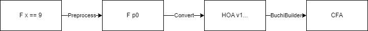
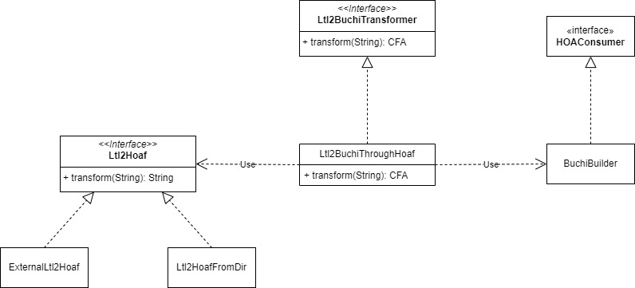

## Overview
This project has two main purposes. The `hu.bme.mit.theta.common.cfa.buchi` package is used to convert properties specified
in the LTL language to Buchi automata as CFA. The `hu.bme.mit.theta.common.ltl` package contains a SafetyChecker that
is able to perform LTL based model checking on any formalism.

## Supported LTL formulae

Currently the following LTL operators are supported in Theta:

| LTL operator   | Symbol |
|----------------|--------|
| Eventually     | F      |
| Globally       | G      |
| Next           | X      |
| Until          | U      |
| Weak until     | W      |
| Release        | R      |
| Strong release | M      |

On top of regular LTL, one can also use complex expressions over the simple variable types. See [Preprocessing](#preprocessing). For complex
examples, look at the [LtlCheckTestWithXstsPred test file](../src/test/kotlin/hu/bme/mit/theta/common/ltl/LtlCheckTestWithXstsPred.kt).

## Converting LTL to Buchi automaton

The main job is done by implementations of the `Ltl2BuchiTransformer` interface. This accepts an LTL formula and
produces a Buchi automaton in Theta representation. The current implementation `Ltl2BuchiThroughHoaf` does the following:

1. Preprocess the input LTL expression by substituting complex expressions with atomic propositions
2. Call a `Ltl2Hoaf` converter that produces the Buchi automaton in the [Hanoi Omega-Automata Format](https://adl.github.io/hoaf/)
3. Use the `BuchiBuilder` object to read the HOAF string and generate a CFA

### Preprocessing

Linear Temporal Logic works with atomic propositions, i.e. variables and expressions can only be of type boolean.
In align to this, most tools won't accept complex formulae, like `F(x == 9)`, i.e. _x is eventually going to become 9_.
To support such expressions, a preprocessing step is implemented. The entry point is in the `ToStringVisitor` class. 
This class creates a new, now valid LTL expression with only atomic propositions, and provides a mapping from these 
propositions to the original expressions. In our previoues example, the result could be `F p0`, and the mapping would contain
`p0 -> x == 9`.

### The purpose of [Hanoi Omega-Automata Format](https://adl.github.io/hoaf/) in the implementation

Since there were no tools or libraries that could have been linked due to licensing issues, it was required
to support calling external tools. HOAF is a standard that has many advantages for us:

* It's widely accepted and adopted by most of the tools related to LTL manipulation
* It's a rather stable but still maintained standard
* There is a library which is now included with theta that provides interfaces to work with HOAF

This allows the end-user to use any tool for the conversion they'd like. They only need to provided a command that runs on their system
and when the `ExternalLtl2Hoaf` runs it by appending the processed LTL formula after it, returns a Buchi automaton in the HOA format.

The recommended tools are [Spot](https://spot.lre.epita.fr/) and [Owl](https://owl.model.in.tum.de/).

#### Supported subset of HOAF

The current implementation has the following limitations on accepted HOAF strings:

| Limitation                                          | Technical meaning                                                                              | Related parser functions  |
|-----------------------------------------------------|------------------------------------------------------------------------------------------------|---------------------------|
| Exactly one initial state is required               | The string should contain exactly one `Start` header                                           | addStartStates, notifyEnd |
| Only transition based acceptance is supported       | The `acc-sig` in a state representation is ignored. Implicit labels cause an exception thrown. | addState, addEdgeImplicit |
| Only single acceptance set automatons are supported | The value of `acc-sig` on an edge is ignored. If any exists, the edge will be accepting        | addEdgeWithLabel          |

It is important to notice that the limitations around acceptances can silently fail and cause bad behaviour. This should be future work to properly check,
or better yet, support them.

### Why CFA?

Implementing Buchi automaton from scratch would have resulted in a lot of duplicate code with the already existing CFA class.
For this reason, CFA is now extended with optional accepting states or edges. Such CFA can perfectly model a Buchi automaton.

Of course, it would be more desirable, to have a common automaton superclass for  CFA and a new Buchi automaton, but this was 
not in scope for the project that developed these packages.

### Automated testing of LTL checking

Running external tools during automated testing such as in the CI/CD processes is not that feasible in the case of Theta.
For various reasons, our tests run on many different platforms. Running the above recommended programs during these tests
would result in a maintenance nightmare:

* The tools would need to be installed on all runner images
* Since most of them are only distributed for linux, calling them would require to be different on different operating systems
  * For example, on windows you might use `WSL`, but the command `wsl` would of course fail on a linux system

For this reason, testing is done with another implementation of `Ltl2Hoaf`. `Ltl2HoafFromDir` is a class that expects
a directory as a parameter. Than when called with an LTL formula, encodes the formula to URL and looks up the resulting
filename.hoa in the directory.

### Architecture

The above interfaces and objects form the following architecture:

## LTL checking

In the ltl package there is a single class the `LtlChecker`. This is a subclass of the safety checker, so it can fit
into most CLI algorithms easily. It uses the conversion mechanisms to create a Buchi automaton. Then uses the
`hu.bme.mit.theta.analysis.multi` package to create a product of this buchi automaton and the model that needs to
be checket. Finally it simply constructs a loopchecker abstractor and refiner, than builds
a `CegarChecker` with them.

For the details of the model checking algorithms, look at the `hu.bme.mit.theta.analysis.algorithm.loopchecker` package
in the common analysis subproject.

## How to run an LTL check

Currently only `xsts` models are supported with CLI execution. Run `xsts-cli` with the `LTLCEGAR` command to utilize it. The usage is the following:

### Input options

Options related to model and property input

| Option                                           | Description                                                                                        |
|--------------------------------------------------|----------------------------------------------------------------------------------------------------|
| --model=<path>                                   | Path of the input model (XSTS or Pnml). Extension should be .pnml to be handled as petri-net input |
| --property=<file>                                | Path of the property file. Has priority over                                                       |
| --inlineProperty                                 |                                                                                                    |
| --inline-property=<text>                         | Input property as a string. Ignored if --property is defined                                       |
| --initialmarking=<text>                          | Initial marking of the pnml model                                                                  |

### Output options

Options related to output and statistics

| Option                                                         | Description                                         |
|----------------------------------------------------------------|-----------------------------------------------------|
| --log-level=(RESULT\|MAINSTEP\|SUBSTEP\|INFO\|DETAIL\|VERBOSE) | Detailedness of logging                             |
| --benchmark=true\|false                                        | Quiet mode, output will be just the result metrics  |
| --cexfile=<path>                                               | Write concrete counterexample to a file             |
| --stacktrace                                                   | Print stack trace of exceptions                     |
| --visualize=<path>                                             | Write proof or counterexample to file in dot format |

### LTL options

Options related to LTL property checking

| Option                                                    | Description                                                                                                                                      |
|-----------------------------------------------------------|--------------------------------------------------------------------------------------------------------------------------------------------------|
| --ltl-expression=<text>                                   | LTL expression to check                                                                                                                          |
| --ltl2buchi-command=<text>                                | A command that runs on your system. The expression gets appended at the end of it.For example, if you use SPOT, this should be: spot ltl2tgba -f |
| --search-strategy=(GDFS\|NDFS\|FULL)                      | Which strategy to use for search                                                                                                                 |
| --refiner-strategy=(DIRECT_REFINEMENT\|BOUNDED_UNROLLING) | Which strategy to use for concretization                                                                                                         |
| --envtran-separation=(COMBINED\|SEPARATE)                 | Whether Buchi evaluation should happen between env and trans transitions or not (SEPARATED and COMBINED, respectively)                           |

### Options

Standard options

| Option                                                                                                                 | Description                            |
|------------------------------------------------------------------------------------------------------------------------|----------------------------------------|
| --version                                                                                                              | Show the version and exit              |
| --solver=<text>                                                                                                        | The solver to use for the check        |
| --smt-home=<path>                                                                                                      |                                        |
| --domain=(EXPL\|PRED_BOOL\|PRED_CART\|PRED_SPLIT\|EXPL_PRED_BOOL\|EXPL_PRED_CART\|EXPL_PRED_SPLIT\|EXPL_PRED_COMBINED) | Abstraction domain to use              |
| --refinement=(FW_BIN_ITP\|BW_BIN_ITP\|SEQ_ITP\|UNSAT_CORE\|MULTI_SEQ)                                                  | Refinement strategy to use             |
| --predsplit=(WHOLE\|CONJUNCTS\|ATOMS)                                                                                  |                                        |
| --refinement-solver=<text>                                                                                             | Use a different solver for abstraction |
| --abstraction-solver=<text>                                                                                            | Use a different solver for refinement  |
| --initprec=(EMPTY\|PROP\|CTRL\|ALLVARS)                                                                                | Initial precision                      |

