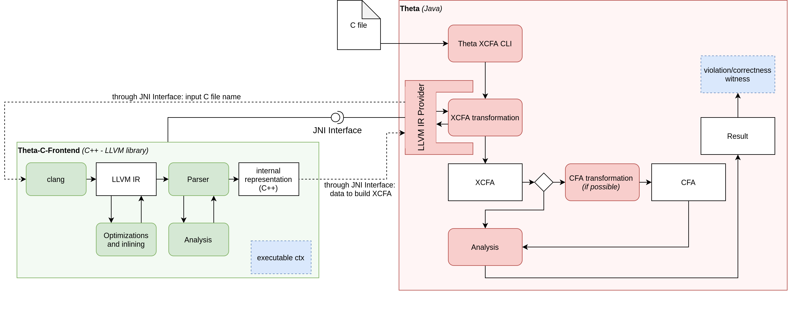

# Theta C Frontend
This repository contains a library, which enables Theta to parse C programs into the XCFA or CFA format using LLVM.

# Motivation
Trying to directly transform a C program into a formal representation comes with several problems due to the complexity of the C language. Using an assembly-like internal representation, such as LLVM IR can largely decrease this complexity.

Currently there is no official LLVM Java API, thus a C++ project is necessary to handle the parsing of LLVM bytecode.

# Connection with Theta
[Link to Theta](https://github.com/ftsrg/theta)

Theta is a configurable and modular, CEGAR-based verification framework. It is capable of handling several formalisms, including Control Flow Automaton *(CFA)* and an extended version of CFA, called XCFA. *(The latter can handle functions and (concurrent) processes.)* 

Theta has a CLI tool and a module for parsing CFA/XCFA files and can convert an XCFA to a CFA, if it is possible *(if it has only one function and one process)*, but has no capability to transform C programs or any other representation of them to these formalisms.

# Connection with Gazer
[Link to Gazer](https://github.com/ftsrg/gazer)

Gazer is a BMC verification tool and Theta frontend written in C++, using the LLVM framework. It handles the transformation to CFA from the C program by itself with an intermediate CFA representation used in its BMC engine. It works as a literal frontend, a CLI tool which handles the transformation and which can call Theta for analysis, parsing and using it's output to get a counterexample. 

Gazer is the predecessor of this library. Many of this its techniques and implementation details are used in this library, but this project has a different, simpler approach. It aims to carry out only a fraction of Gazer's functionality, namely it has no BMC engine, so it cannot carry out software verification and it will not output a CFA or an XCFA in any way. It carries out only the transformation of a C program to an intermediate representation containing the necessary information for the construction of an XCFA, adding some LLVM passes on the way.

As opposed to Gazer, this library approaches its usage in a reversed manner, being called and used by Theta as a native C++ library, not the other way around. It's long term goal is to be a fairly static library in a way, that extensions and implementation of new features related to the formalisms or the analysis can happen mainly in Theta, as it has better maintainability and is actively developed.

# Transforming the program

*The red parts are modules/classes of Theta, the green ones are of this project and the blue ones are yet to be implemented - they are not properly connected yet, as their place in the project isn't certain yet*

## Input
The input file can either be bitcode (`.ll` pr `.bc`, LLVM passes are not used in this case) or a C program (a single `.c` or `.i` file). Implementing a linking step of more than one input files is not yet implemented. *(But it is an important feature for the future.)* 

## Compilation (clang)
This is a simple step - we just call clang with a few flags to compile the C program to bitcode. We use O0, as most optimization passes that we benefit from are executed in the next step.

## Documentation of the remaining steps
[Our intermediate representation](doc/intermediate-representation.md)

[Passes and optimizations](doc/passes.md)

[JNI interface](doc/jni-interface.md)

[Analysis in the frontend](doc/analysis.md)

[A simple example from input program to xcfa](doc/simple-example.md)
