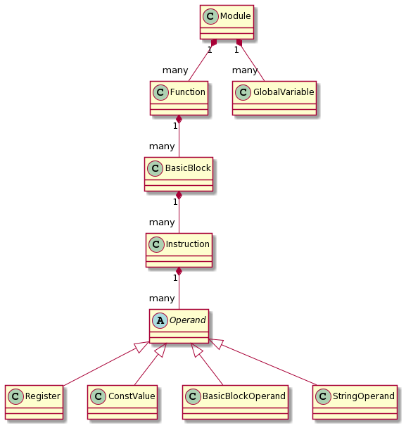
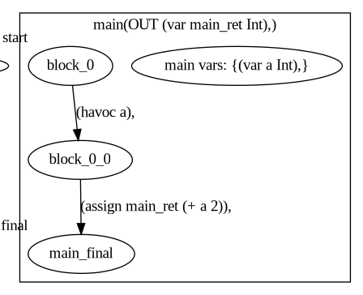

## A simple example
### Input
Let's give a simple example program as input:
``` C
#include <stdio.h>

int main() {
    int a;
    scanf("%d", &a);

    int b = 0;
    b = a+2;
    return b;
}
```

### LLVM IR
After compilation with clang and executing the passes, we get the following LLVM IR:
*(Note: LLVM IR is rather verbose, so some attributes have been cut out from the middle, as they are insignificant in this example)*
```llvm
; ModuleID = 'example.bc'
source_filename = "example.c"
target datalayout = "e-m:e-p270:32:32-p271:32:32-p272:64:64-i64:64-f80:128-n8:16:32:64-S128"
target triple = "x86_64-pc-linux-gnu"

@.str = private unnamed_addr constant [3 x i8] c"%d\00", align 1

; Function Attrs: noinline nounwind sspstrong uwtable
define dso_local i32 @main() local_unnamed_addr #0 !dbg !9 {
  %lastblock = alloca i64, align 8
  %1 = alloca i32, align 4
  call void @llvm.dbg.value(metadata i32* %1, metadata !14, metadata !DIExpression(DW_OP_deref)), !dbg !15
  call i32 (i8*, ...) @__isoc99_scanf(i8* getelementptr inbounds ([3 x i8], [3 x i8]* @.str, i64 0, i64 0), i32* nonnull %1) #3, !dbg !16
  call void @llvm.dbg.value(metadata i32 0, metadata !17, metadata !DIExpression()), !dbg !15
  %2 = load i32, i32* %1, align 4, !dbg !18
  call void @llvm.dbg.value(metadata i32 %2, metadata !14, metadata !DIExpression()), !dbg !15
  %3 = add nsw i32 %2, 2, !dbg !19
  call void @llvm.dbg.value(metadata i32 %3, metadata !17, metadata !DIExpression()), !dbg !15
  ret i32 %3, !dbg !20
}

declare i32 @__isoc99_scanf(i8*, ...) local_unnamed_addr #1

; Function Attrs: nounwind readnone speculatable willreturn
declare void @llvm.dbg.value(metadata, metadata, metadata) #2

(...)

!llvm.dbg.cu = !{!0}
!llvm.module.flags = !{!3, !4, !5, !6, !7}
!llvm.ident = !{!8}

!0 = distinct !DICompileUnit(language: DW_LANG_C99, file: !1, producer: "clang version 11.1.0", isOptimized: false, runtimeVersion: 0, emissionKind: FullDebug, enums: !2, splitDebugInlining: false, nameTableKind: None)
!1 = !DIFile(filename: "/home/solarowl/Downloads/tmp/frontend-example/example.c", directory: "/home/solarowl/Research/Protos/theta-c-frontend")
!2 = !{}
!3 = !{i32 7, !"Dwarf Version", i32 4}
!4 = !{i32 2, !"Debug Info Version", i32 3}
!5 = !{i32 1, !"wchar_size", i32 4}
!6 = !{i32 7, !"PIC Level", i32 2}
!7 = !{i32 7, !"PIE Level", i32 2}
!8 = !{!"clang version 11.1.0"}
!9 = distinct !DISubprogram(name: "main", scope: !10, file: !10, line: 3, type: !11, scopeLine: 3, spFlags: DISPFlagDefinition, unit: !0, retainedNodes: !2)
!10 = !DIFile(filename: "Downloads/tmp/frontend-example/example.c", directory: "/home/solarowl")
!11 = !DISubroutineType(types: !12)
!12 = !{!13}
!13 = !DIBasicType(name: "int", size: 32, encoding: DW_ATE_signed)
!14 = !DILocalVariable(name: "a", scope: !9, file: !10, line: 4, type: !13)
!15 = !DILocation(line: 0, scope: !9)
!16 = !DILocation(line: 5, column: 5, scope: !9)
!17 = !DILocalVariable(name: "b", scope: !9, file: !10, line: 7, type: !13)
!18 = !DILocation(line: 8, column: 9, scope: !9)
!19 = !DILocation(line: 8, column: 10, scope: !9)
!20 = !DILocation(line: 9, column: 5, scope: !9)

```
There are two important parts in the IR:
- the IR version of the main function, starting from `define dso_local i32 @main() local_unnamed_addr #0 !dbg !9 {`
- and the metadata in the second half - each line starting with a `!` and a number represents some kind of metadata, e.g. `!14 = !DILocalVariable(name: "a", scope: !9, file: !10, line: 4, type: !13)` tells us, that the register annotated with `!14` is connected to the local variable `a`.

We can also notice the SSA (single static assignment) nature of LLVM IR in this example: `!17` shows in `main` more than once, as each time `b` has a new value assigned, a new register has to be created, as virtual registers in LLVM can only be assigned once.

### Our intermediate representation
The customized representation we use has no textual syntax, as it would be superfluous, rather it can be shown as a class hierarchy, loosely following that of LLVM IR. 
It is noteworthy to mention some of the differences here:
- LLVM IR has no register/operand classes, only instructions
- We have no separate metadata classes, e.g. the register class contains the above mentioned DILocalVariable itself in the form of the variable name
- We handle only the fraction of information contained in LLVM IR, e.g. we only store the `name: "a"` part of the `!DILocalVariable` metadata, even though it contains a scope, line, filename, etc. 


### XCFA
At the end of our example execution we get the XCFA from Theta, which van be printed into a graphviz (dot) format:


Although in the representation before the xcfa we had the registers representing `b`, during the XCFA transformation in Theta the `b = a + 2; main_ret = b` sequence was merged into `main_ret = a + 2`. 
