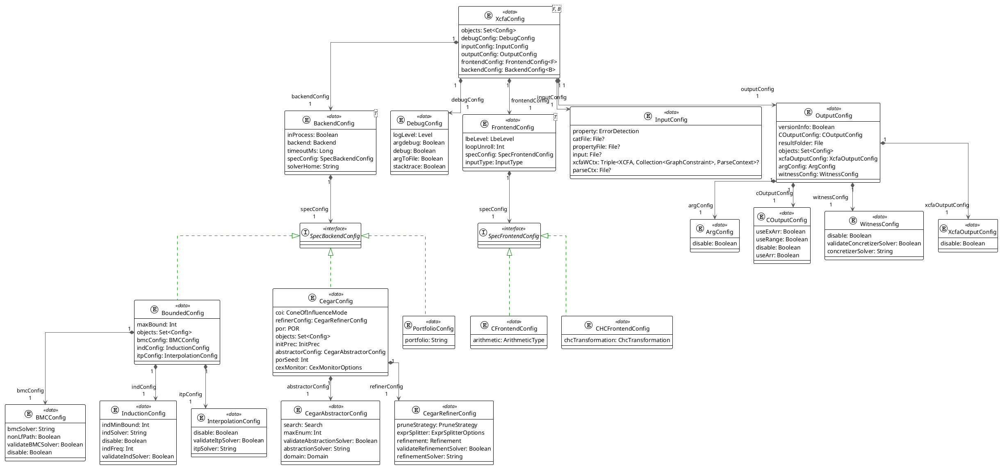
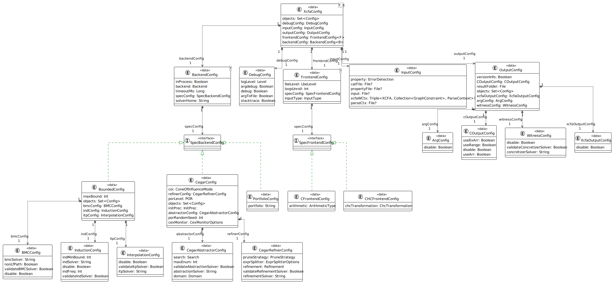

## Overview

This project contains an executable tool (command line) for running analyses on XCFAs.

### Related projects

* [`xcfa`](../xcfa/README.md): Classes to represent XCFAs.
* [`xcfa-analysis`](../xcfa-analysis/README.md): XCFA specific analysis modules enabling the
  algorithms to operate on them.

## Tool

First, [build](../../doc/Build.md) the projects. The runnable jar file will appear under
_build/libs/_ with the name _
theta-xcfa-cli-\<VERSION\>-all.jar_. You can simply rename it to _theta-xcfa-cli.jar_.

The tool can be run with `java -jar theta-xcfa-cli.jar [arguments]`. If no arguments are given, a
help screen is
displayed about the arguments and their possible values. For
example `java -jar theta-xcfa-cli.jar --input program.c --loglevel INFO` runs the default analysis
with logging on
the `program.c` input file.

## Configuration

UML Source

